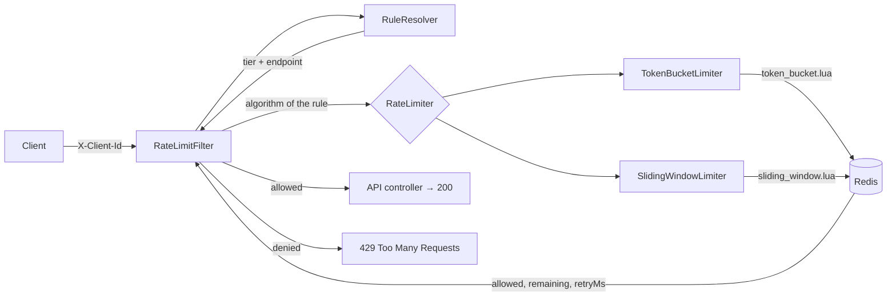

# Distributed Rate Limiter

A Spring Boot service that limits how many requests each client can make, with the shared state in Redis, so the limit holds no matter how many app instances are running.

[](https://github.com/devanshigautam/distributed-rate-limiter/actions/workflows/ci.yml)

**Stack:** Java 21 · Spring Boot 4 · Redis 7 · Lua · Docker Compose · JUnit 5 · Testcontainers · GitHub Actions

## What it does

APIs need protection from clients that send too many requests. Counting in each app instance's memory breaks as soon as there are several instances: with 3 instances, every client gets 3× the limit.

This service keeps the limit state per client and endpoint in Redis, with two algorithms chosen per rule: a **token bucket** (allows controlled bursts, constant memory) and a **sliding window log** (exact, memory grows with traffic). Each check runs as a single **Lua script inside Redis**, so it is atomic across every instance.

Proven by a test where **50 threads send 1,000 requests at a limit of 100: exactly 100 are allowed, for both algorithms, in 20 out of 20 runs**, and by a negative control showing a non-atomic version lets more than 100 through.

## Architecture



**Request path**

1. A request arrives with an `X-Client-Id` header (missing → `400`).
2. `RateLimitFilter` asks `RuleResolver` for the rule: client → tier → `(tier, endpoint)` rule, falling back to a default rule.
3. The filter picks the limiter for the rule's algorithm and runs its Lua script in Redis with the key `rl:{tb|sw}:{clientId}:{endpoint}`.
4. **Token bucket:** refill for the elapsed time, take a token if available, save. **Sliding window:** drop timestamps older than the window, count the rest, add this request if under the limit. Both return `{allowed, remaining, retryAfterMs}`.
5. Allowed → the request continues to the controller. Denied → `429` with `Retry-After`.
6. Every response carries `X-RateLimit-Limit` and `X-RateLimit-Remaining`.

`/actuator/**` is never rate-limited, so health checks always work.

## Run it

Requires Java 21 and Docker.

```bash
docker compose up -d          # start Redis
./mvnw spring-boot:run        # start the app on :8080
```

Send 15 quick requests as a free-tier client (bucket of 10):

```bash
for i in $(seq 1 15); do
  curl -s -o /dev/null -w "%{http_code} " -H "X-Client-Id: devanshi" localhost:8080/api/orders
done
# 200 200 200 200 200 200 200 200 200 200 429 429 429 429 429
```

Windows (Command Prompt):

```
for /L %i in (1,1,15) do @curl.exe -s -o NUL -w "%{http_code} " -H "X-Client-Id: devanshi" http://localhost:8080/api/orders
```

## Configuration

Limits live in `application.yaml`, so they change without code changes:

```yaml
ratelimit:
  fail-open: true            # Redis down: true = allow, false = 503
  default-tier: free         # tier for unknown clients
  default-rule:              # used when no rule matches tier + endpoint
    capacity: 5
    refill-per-second: 1
  clients:
    devanshi: free
    priya: premium
  rules:
    - tier: free
      endpoint: /api/orders
      algorithm: token-bucket
      capacity: 10           # max burst
      refill-per-second: 1   # sustained rate
    - tier: premium
      endpoint: /api/orders
      algorithm: sliding-window
      capacity: 100          # 100 requests per window...
      refill-per-second: 50  # ...of 100 / 50 = 2 seconds
```

For the sliding window, the window length is `capacity / refill-per-second`, so switching a rule's algorithm keeps the same average rate and only changes how strictly bursts are treated.

Values are validated at startup (`@Positive`), so a bad config fails fast instead of misbehaving at runtime.

## Design decisions

| Decision | Choice | Rejected alternative | Why |
|---|---|---|---|
| Where state lives | Redis | In-memory counter per instance | With N instances, the real limit becomes N× the configured one |
| Atomicity | One Lua script per check | Read in Java, then write back | Two instances can read the same count and both allow the request |
| Atomicity | Lua | `MULTI`/`EXEC` (+ `WATCH`) | A transaction can't branch on a value read inside it; `WATCH` retries pile up under contention |
| Clock | `redis.call('TIME')` inside the script | Timestamp sent by each instance | Instance clocks drift; one shared clock removes skew |
| Algorithm (default) | Token bucket | Fixed window counter | Fixed windows allow up to 2× the limit across a window boundary; the bucket allows controlled bursts with fixed memory (2 fields per key) |
| Algorithm (strict) | Sliding window log (sorted set) | — | Exact: never more than N in any window. Costs one sorted-set entry per request, so it suits low, strict limits |
| Sliding window members | `timestamp-UUID` | Timestamp only | Two requests in the same millisecond would share a member and silently merge into one |
| Redis unavailable | Configurable fail-open / fail-closed | Always fail-closed | Fail-open keeps the API up; fail-closed protects a fragile downstream. The right answer depends on the endpoint |
| Key cleanup | `PEXPIRE` on every write | No expiry | Idle clients would otherwise leave keys in Redis forever |
| Algorithm abstraction | `RateLimiter` interface, all implementations injected as a list and indexed by `Algorithm` | Filter calls one limiter directly | A new algorithm is a new Lua script + class; the filter doesn't change |

## How correctness is proven

61 automated tests run on every push via GitHub Actions. Integration tests use **Testcontainers** to start a real `redis:7` container, because a mock can't execute Lua.

| Test | What it proves |
|---|---|
| [`ConcurrencyTest`](src/test/java/com/devanshi/distributed_rate_limiter/limiter/ConcurrencyTest.java) | 50 threads released together by a `CountDownLatch` send 1,000 requests at a limit of 100 → **exactly 100 allowed**, for both algorithms. Repeated 20 times each; must pass every time |
| [`NonAtomicLimiterTest`](src/test/java/com/devanshi/distributed_rate_limiter/limiter/NonAtomicLimiterTest.java) | Negative control: a limiter that reads in Java and writes back in a second call lets **more than 100** through under the same race, so the concurrency test really can catch the bug |
| [`TokenBucketLimiterTest`](src/test/java/com/devanshi/distributed_rate_limiter/limiter/TokenBucketLimiterTest.java) | Burst of 10 allowed, 11th denied with a sensible retry time, allowed again after refill; each client has its own bucket |
| [`RateLimitFilterHttpTest`](src/test/java/com/devanshi/distributed_rate_limiter/limiter/RateLimitFilterHttpTest.java) | Over real HTTP: `429` + `X-RateLimit-*` + `Retry-After` after the burst, premium client on the sliding window with limit 100, `400` without a client id, health endpoint never limited |
| [`SlidingWindowLimiterTest`](src/test/java/com/devanshi/distributed_rate_limiter/limiter/SlidingWindowLimiterTest.java) | Limit per window, deny, allowed again once the window slides; one sorted-set entry per request and the key expires |
| [`RateLimitFilterTest`](src/test/java/com/devanshi/distributed_rate_limiter/limiter/RateLimitFilterTest.java) | Fast Mockito unit tests of the filter with a fake limiter: allow, `429` with `Retry-After` rounded up, `400`, fail-open, fail-closed. No Redis or Docker |
| [`FailOpenTest`](src/test/java/com/devanshi/distributed_rate_limiter/limiter/FailOpenTest.java) / [`FailClosedTest`](src/test/java/com/devanshi/distributed_rate_limiter/limiter/FailClosedTest.java) | Stops Redis mid-test; requests return `200` with fail-open and `503` with fail-closed |
| [`RuleResolverTest`](src/test/java/com/devanshi/distributed_rate_limiter/limiter/RuleResolverTest.java) | Known client → their tier's rule and algorithm; unknown client → default tier; unknown endpoint → default rule; window length keeps the same average rate |

Run them (Docker must be running):

```bash
./mvnw verify
```

## Project layout

```
src/main/java/.../limiter/
  RateLimitFilter.java       servlet filter: identify client, pick limiter, 200 or 429
  RuleResolver.java          client → tier → rule
  RateLimiter.java           interface: algorithm() + check(key, rule) → Decision
  Algorithm.java             TOKEN_BUCKET | SLIDING_WINDOW
  TokenBucketLimiter.java    runs token_bucket.lua in Redis
  SlidingWindowLimiter.java  runs sliding_window.lua in Redis
  RateLimiterConfig.java     loads both scripts, enables the config properties
  RateLimitProperties.java   typed, validated "ratelimit:" settings
  RateLimitRule.java         capacity + refill rate + algorithm (+ window length)
  Decision.java              allowed + remaining + retryAfterMs
src/main/java/.../web/
  DemoController.java        sample API being protected (/api/orders, /api/hello)
src/main/resources/
  scripts/token_bucket.lua   the atomic token bucket
  scripts/sliding_window.lua the atomic sliding window log
  application.yaml           Redis address + rate limit rules
docker-compose.yml           Redis for local development
```

## Tradeoffs and next steps

- **At 100× the load:** Redis Cluster, with keys hash-tagged (`rl:tb:{client}:...`) so one client's bucket stays on one shard. Optionally a small local pre-check to skip Redis for clients far below their limit, trading exactness for latency.
- **Across regions:** per-region limits with async sync, accepting a bounded overshoot.
- **Planned:** multiple instances behind a load balancer; Prometheus metrics and a Grafana dashboard; k6 load tests with measured latency and accuracy in a `BENCHMARKS.md`.

## Limitations

- One Redis instance: it is a single point of failure, handled by fail-open/fail-closed rather than replication.
- Clients identify themselves with a header; there is no authentication.
- Rules are loaded at startup; changing them requires a restart.
